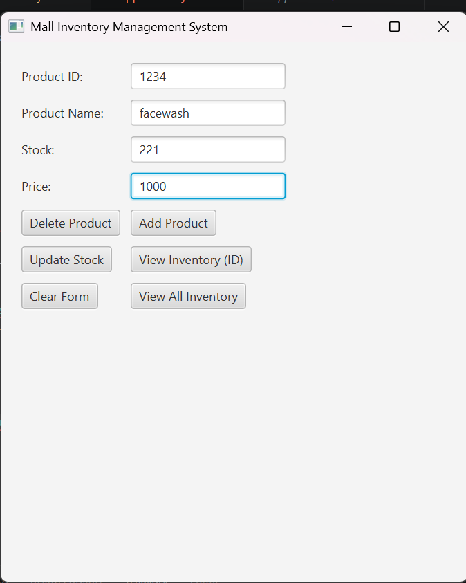
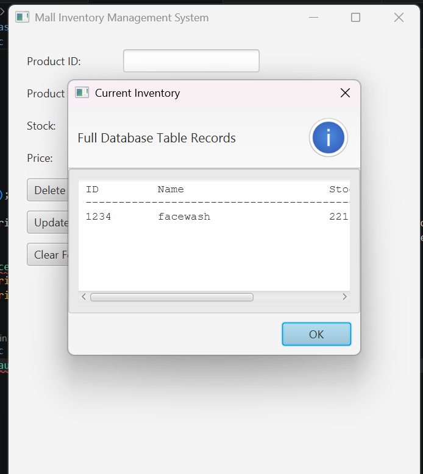
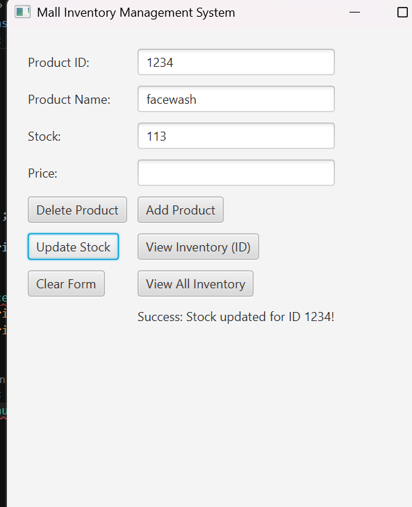
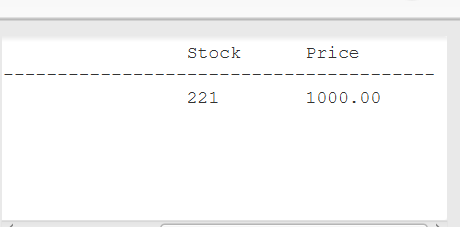

# Advanced Mall Inventory Management System

A desktop-based inventory management application built using Java, JavaFX, JDBC, and MySQL.

## Features

* Add new products
* Update product stock
* Delete products
* Search products by ID
* View complete inventory
* MySQL database integration using JDBC
* Object-Oriented Programming (OOP) design
* Input validation and exception handling

## Technologies Used

* Java
* JavaFX
* JDBC
* MySQL
* IntelliJ IDEA

## Screenshots

### Main Application

### Add Product

### Update Product Stock

### Product Details

### Database Connectivity
.png)

## Project Structure

* Product.java
* InventoryManager.java
* AppWindow.java
* Database Connection Layer

## Future Enhancements

* Search by product name
* Export inventory reports
* User authentication
* Dashboard analytics
